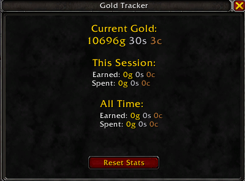

# GoldTracker

A lightweight World of Warcraft addon for tracking gold earned and spent across all your characters.

## Features

- **Per-Character Tracking** - Each character has independent gold statistics
- **Session Statistics** - Track gold earned and spent during your current play session
- **All-Time Statistics** - View total gold earned and spent across all sessions
- **First Login Detection** - Won't count your starting gold as "earned" on first use
- **Minimap Button** - Easy access via draggable minimap icon
- **Clean UI** - Simple, movable window with clear statistics
- **Persistent Data** - All data is saved between sessions and survives logouts

## Installation

### Manual Installation

1. Download the latest release
2. Extract the `BasicGoldTracker` folder to your `World of Warcraft\_retail_\Interface\AddOns\` directory
3. Restart World of Warcraft or type `/reload` in-game

## Usage

### Opening the Tracker

- **Minimap Button** - Left-click the gold coin icon on your minimap
- **Slash Commands** - Type `/goldtracker` or `/gt` in chat
- **Close Window** - Press ESC or click the X button

### Minimap Button

- **Left-Click** - Toggle the tracker window
- **Right-Click** - Reset all statistics for current character
- **Drag** - Move the button around the minimap edge

### Commands

- `/goldtracker` or `/gt` - Toggle the tracker window
- `/gt reset` - Reset all statistics for the current character

## What's Tracked

### Current Gold
Displays your current gold amount in real-time.

### This Session
- **Earned** - Gold gained since you logged in
- **Spent** - Gold spent since you logged in

### All Time
- **Earned** - Total gold earned across all sessions on this character
- **Spent** - Total gold spent across all sessions on this character

## How It Works

GoldTracker automatically monitors your gold changes and categorizes them:

- **Gold Gained** - Looting, quest rewards, mail, sales, etc.
- **Gold Spent** - Purchases, repairs, auction house fees, mail costs, etc.

The addon tracks your gold balance continuously and updates statistics whenever your gold changes. Session statistics reset each time you log in, while all-time statistics persist forever (until manually reset).

## Screenshots

## FAQ

**Q: Does this track gold across all my characters?**  
A: Each character has independent statistics. The addon tracks per-character, not account-wide.

**Q: What happens on first login?**  
A: The addon will record your starting gold as a baseline without adding it to "earned" statistics.

**Q: Can I reset my statistics?**  
A: Yes! Use `/gt reset` or do it from the GUI.

**Q: Does this affect game performance?**  
A: No! GoldTracker is extremely lightweight and only updates when your gold changes.

**Q: Is my data safe if I reinstall the addon?**  
A: Yes! Data is stored in your WoW SavedVariables folder and persists through addon reinstalls.

## Support

If you encounter any issues or have suggestions:

1. Check that you have the latest version
2. Ensure all required libraries are installed
3. Try `/reload` to refresh the addon
4. Report issues on the GitHub Issues page

## Credits

- Built with [Ace3](https://www.wowace.com/projects/ace3)
- Uses [LibDBIcon-1.0](https://www.wowace.com/projects/libdbicon-1-0) for minimap functionality

## License

This addon is released under the MIT License. See LICENSE file for details.

## Changelog

### Version 1.0.0
- Initial release
- Per-character gold tracking
- Session and all-time statistics
- Minimap button with drag support
- Slash commands
- ESC key support
- First login detection
